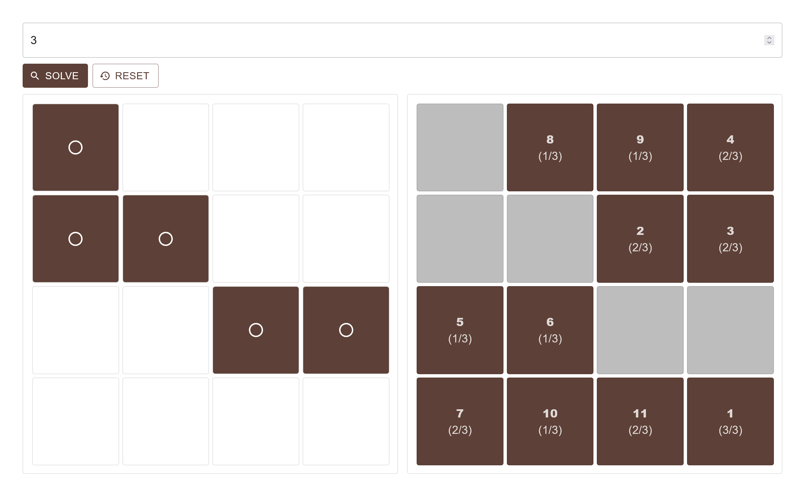

# Project Ruby

An SPA port of project ruby and, by extension, project ruby native.

Use the panel on the left to mimic the state of your activity card and adjust the number of wild stamps, then solve!

The bold numbers represent the optimal order of stamps to use, the number below should correctly match the number of wild stamps you have in each step.
